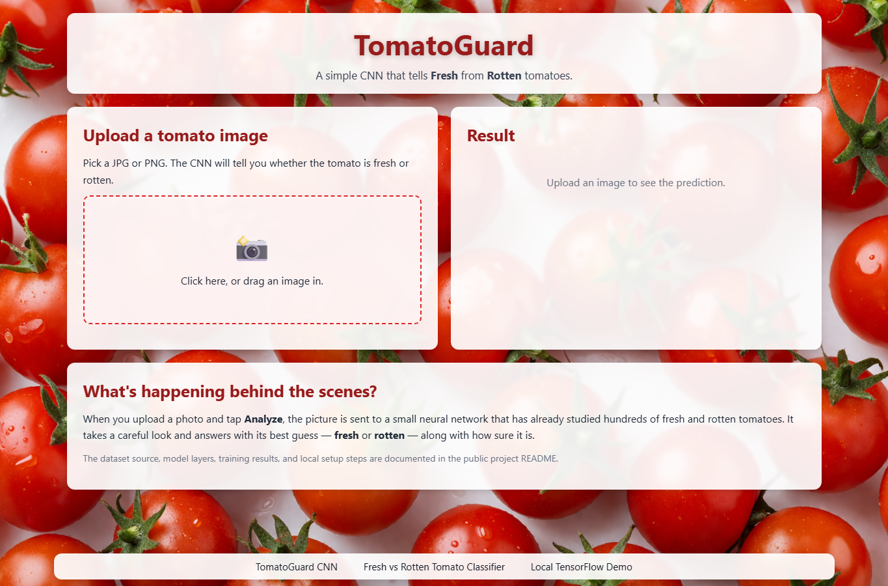
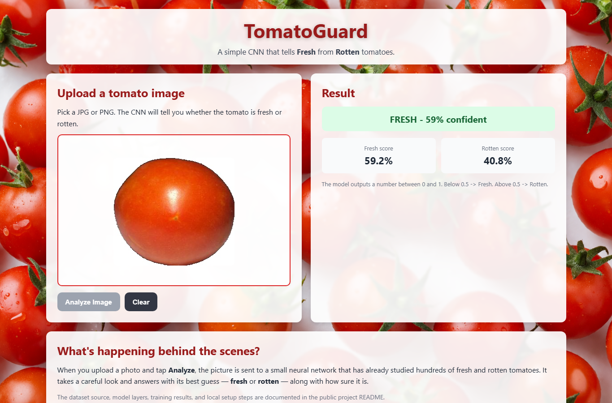

# TomatoGuard CNN

TomatoGuard is a local web demo for classifying tomato images as **fresh** or
**rotten** with a small Convolutional Neural Network (CNN). The project includes
the dataset preparation script, training script, saved TensorFlow model, local
Python server, and a browser UI for uploading a tomato image and viewing the
prediction.

This public version intentionally excludes private academic submission files,
personal identity details, and institution details.

## Screenshots

Real screenshots captured from the local HTML interface are stored in
`docs/screenshots/`.





## What the Project Does

1. Downloads the public FGrade tomato image dataset.
2. Builds a balanced binary dataset:
   - `fresh`
   - `rotten`
3. Trains a small CNN from scratch.
4. Saves the trained model as `tomato_model.h5`.
5. Runs a local web app at `http://127.0.0.1:8000`.
6. Lets the user upload a tomato image and returns:
   - predicted label
   - fresh score
   - rotten score
   - confidence value

## Dataset Source

The dataset source is **FGrade**, a public tomato freshness dataset by Das, Kar,
and Sekh. It contains 6,470 single-tomato images with freshness grades from 1 to
10.

Source repository: <https://github.com/skarifahmed/FGrade>

For this binary classifier, grades 1-5 are grouped as **fresh** and grades 6-10
are grouped as **rotten**. The project samples 800 images total:

| Split | Fresh | Rotten | Total |
| --- | ---: | ---: | ---: |
| `dataset/trained/` | 250 | 250 | 500 |
| `dataset/not_trained/` | 150 | 150 | 300 |
| Total | 400 | 400 | 800 |

## Model Summary

The model is a compact CNN trained from scratch:

```text
Input image
RandomFlip
RandomRotation
RandomZoom
Conv2D(32) + MaxPooling2D
Conv2D(64) + MaxPooling2D
Conv2D(128) + MaxPooling2D
Flatten
Dense(128)
Dropout(0.5)
Dense(1, sigmoid)
```

The final sigmoid output is interpreted as:

- below `0.5`: fresh
- `0.5` or above: rotten

Current saved training results are in `training_results.json`.

## Project Structure

```text
Final_tomatoes_cnn/
├── 1_prepare_dataset.py       # Download and prepare the FGrade image split
├── 2_train_model.py           # Train and evaluate the CNN
├── 3_server.py                # Run the local web server and prediction API
├── requirements.txt           # Python dependency list
├── start.bat                  # Windows launcher
├── tomato_colab.ipynb         # Optional Google Colab training notebook
├── tomato_model.h5            # Saved trained model
├── training_results.json      # Saved accuracy/loss/confusion matrix
├── assets/
│   └── background.png
├── dataset/
│   ├── trained/
│   │   ├── fresh/
│   │   └── rotten/
│   └── not_trained/
│       ├── fresh/
│       └── rotten/
├── docs/
│   ├── PROJECT_ARCHIVE.md
│   └── screenshots/
└── web/
    ├── index.html
    ├── style.css
    └── app.js
```

## Build and Run Locally

Use Python 3.9 or newer.

```powershell
pip install -r requirements.txt
python 3_server.py
```

Then open:

```text
http://127.0.0.1:8000
```

The trained model and prepared dataset are already included. To rebuild the
dataset and retrain the model from scratch, run:

```powershell
pip install -r requirements.txt
python 1_prepare_dataset.py
python 2_train_model.py
python 3_server.py
```

On Windows, `start.bat` can also be used to launch the server after dependencies
are installed.

## How to Use

1. Start the server with `python 3_server.py`.
2. Open `http://127.0.0.1:8000`.
3. Click the upload area or drag a tomato image into it.
4. Click **Analyze Image**.
5. Review the predicted class and confidence scores.

## Notes for Public Use

- The app is designed for local demonstration and portfolio presentation.
- It is not a production food-safety tool.
- Predictions depend on image quality, lighting, background, and how similar the
  uploaded image is to the FGrade dataset.
- Private college report files are not part of this public repository.
